<!-- (C) 2020 Diogo Rodrigues, Tomás Agante Martins -->
<!-- Licensed under the terms of the GNU General Public License v3 -->

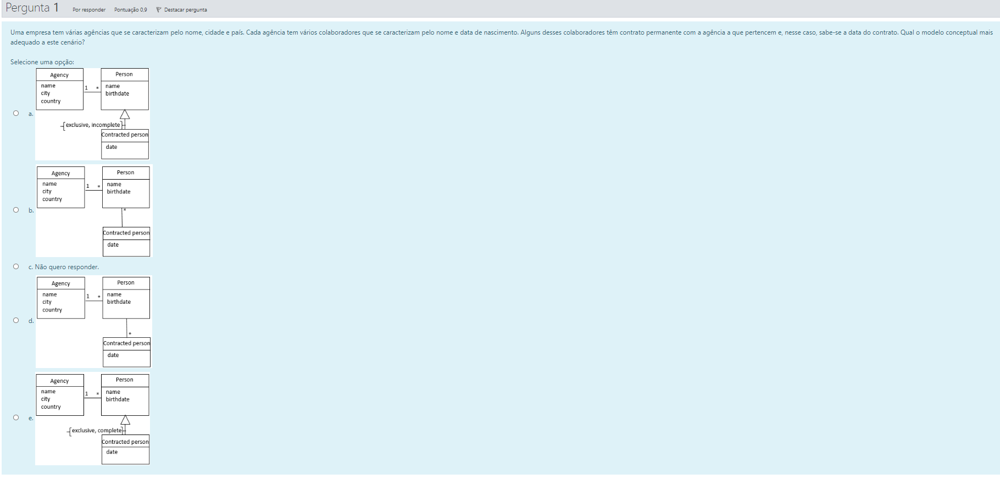

## Pergunta 1

| Item   | Resposta | Nota |
|--------|----------|------|
| **a.** | ✔        | A melhor resposta, por exclusão de partes. |
| **b.** | ✖        | Uma `Contracted Person` é uma especialização de `Person`, logo só pode corresponder a uma `Person`. |
| **c.** | ✖        | Não quero responder. |
| **d.** | ✖        | Uma `Contracted Person` é uma especialização de `Person`, logo a relação tem que ser uma generalização, e não uma associação. |
| **e.** | ✖        | A generalização não pode ser `complete`, porque nem todas as pessoas foram contratadas. |

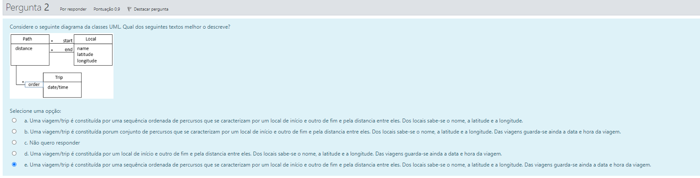

## Pergunta 2

| Item   | Resposta | Nota |
|--------|----------|------|
| **a.** | ✖        | Não se menciona o `date/time` da viagem. |
| **b.** | ✖        | Uma viagem não é um conjunto de percursos, mas sim uma sequência. |
| **c.** | ✖        | Não quero responder. |
| **d.** | ✖        | Uma viagem pode ter vários percursos, não só um local de início e outro de fim. |
| **e.** | ✔        | A melhor resposta, por exclusão de partes. |

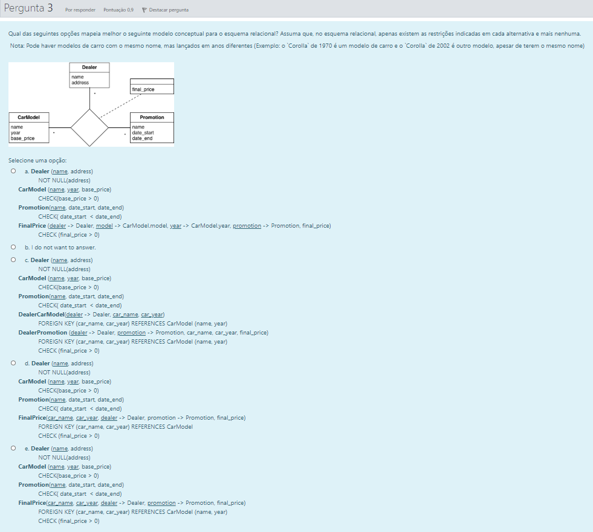

## Pergunta 3

| Item   | Resposta | Nota |
|--------|----------|------|
| **a.** | ✖        | `CarModel` não tem nenhum atributo `model`. |
| **b.** | ✖        | Não quero responder. |
| **c.** | ✖        | Muito confuso, uma relação ternária só dá origem a uma relação. |
| **d.** | ✖        | `promotion` tem que ser uma chave externa. |
| **e.** | ✔        | A melhor resposta, por exclusão de partes. |

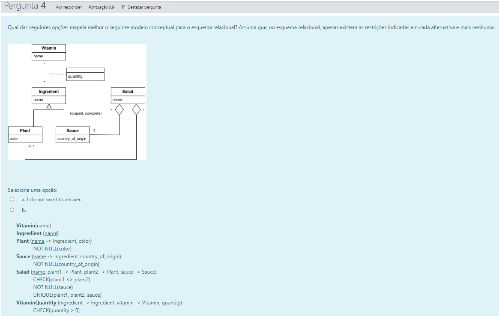

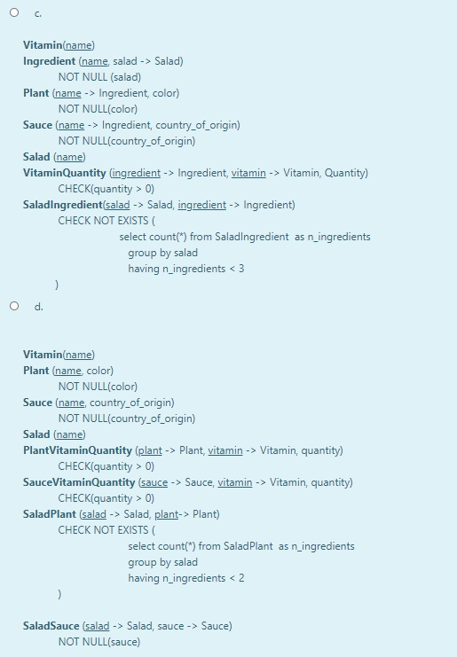

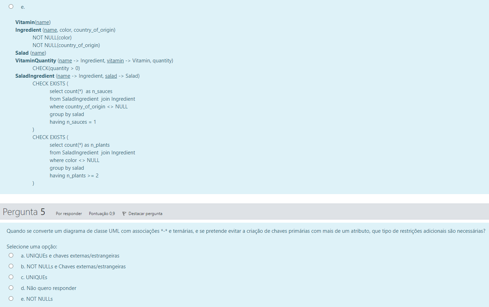

## Pergunta 4

| Item   | Resposta | Nota |
|--------|----------|------|
| **a.** | ✖        | Não quero responder. |
| **b.** | ✖        | Uma `Salad` só consegue apontar para duas plantas. |
| **c.** | ✖        | Um `ingredient` não precisa de apontar para uma salada. |
| **d.** | ✔        | Possivelmente correta. Apesar disso, dá para meter mais que um sauce em cada Salad |
| **e.** | ✖        | Se for planta, countyr é NULL; se for sauce, color é NULL... |

## Pergunta 5

| Item   | Resposta | Nota |
|--------|----------|------|
| **a.** UNIQUEs e chaves externas/estrangeiras   | ✖        | Não tenho a certeza |
| **b.** NOT NULLs e chaves externas/estrangeiras | ✖        | |
| **c.** UNIQUEs                                  | ✔        | |
| **d.** Não quero responder                      | ✖        | |
| **e.** NOT NULLs                                | ✖        | |

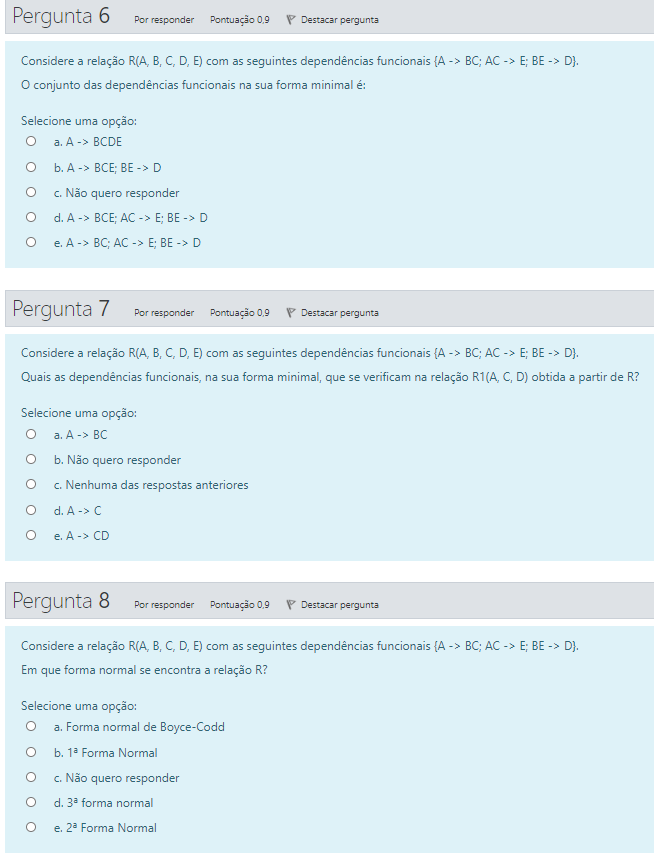

## Pergunta 6

```
A  → BC
AC → E
BE → D
```

`C` em `AC → E` é dispensável, dado que `{A}+ = {A, B, C}+ = {A, B, C, E}+ = {A, B, C, E}`.

```
A  → BC
A  → E
BE → D
```

Agrupando FDs com o mesmo lado esquerdo,

```
A  → BCE
BE → D
```

| Item   | Resposta | Nota |
|--------|----------|------|
| **a.** | ✖        | -    |
| **b.** | ✔        | -    |
| **c.** | ✖        | Não quero responder. |
| **d.** | ✖        | -    |
| **e.** | ✖        | -    |

## Pergunta 7

| Item   | Resposta | Nota |
|--------|----------|------|
| **a.** | ✖        | `B` não faz parte de `R1` |
| **b.** | ✖        | Não quero responder. |
| **c.** | ✖        | Falso, porque encontrámos uma resposta correta. |
| **d.** | ✖        | `D` também depende de `A` |
| **e.** | ✔        | `{A}+ = {A, B, C}+ = {A, B, C, E}+ = {A, B, C, D, E}+ = {A, B, C, D, E}` |

## Pergunta 8

`R` está trivialmente na 1NF.

A única chave candidata é `{A}` (`{A}+ = {A, B, C}+ = {A, B, C, E}+ = {A, B, C, D, E}+ = {A, B, C, D, E}`).

Dos atributos não-primos `B, C, D, E`, nenhum depende de um subconjunto próprio de uma chave, dado que um conjunto com 1 elemento (como a chave `{A}`) não possui subconjuntos próprios além do conjunto vazio. Assim, `R` está na 2NF.

Na relação `A → BC`, `A` é superchave. Na relação `AC → E`, `E` é não-primo. Na relação `BE → D`, `D` é não-primo. Logo, `R` está na 3NF.

Na relação `BE → D`, `BE` não é superchave, logo esta FD viola a BCNF.

| Item                              | Resposta |
|-----------------------------------|----------|
| **a.** Forma normal de Boyce-Codd | ✖        |
| **b.** 1ª Forma Normal            | ✖        |
| **c.** Não quero responder        | ✖        |
| **d.** 3ª Forma Normal            | ✔        |
| **e.** 2ª Forma Normal            | ✖        |

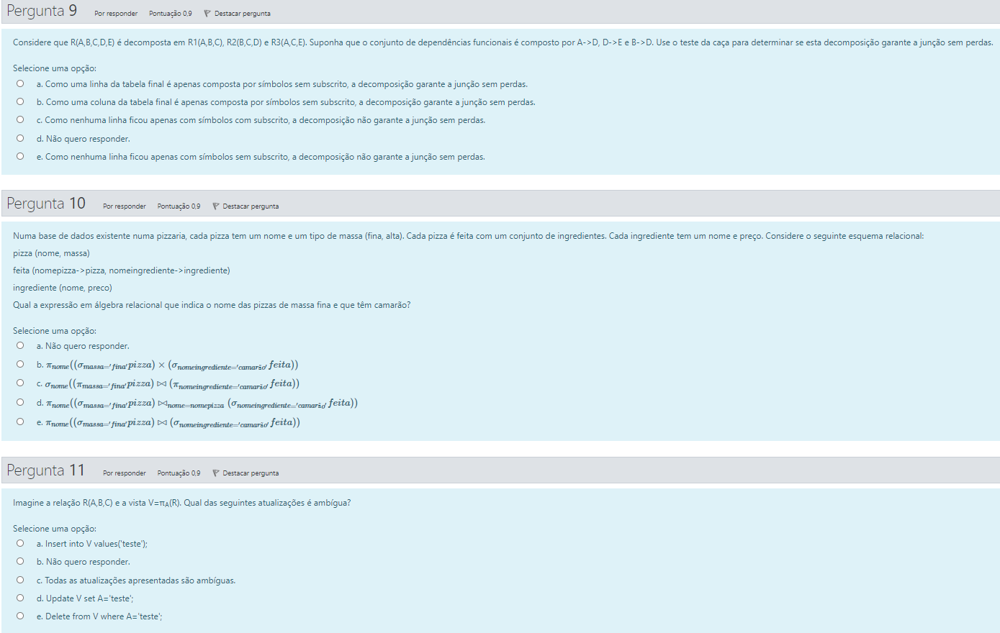

## Pergunta 9

|      | A  | B  | C  | D  | E  |
|------|----|----|----|----|----|
| `R1` | a  | b  | c  | d1 | e1 |
| `R2` | a2 | b  | c  | d  | e2 |
| `R3` | a  | b3 | c  | d3 | e  |

`A → D`

|      | A  | B  | C  | D  | E  |
|------|----|----|----|----|----|
| `R1` | a  | b  | c  | d1 | e1 |
| `R2` | a2 | b  | c  | d  | e2 |
| `R3` | a  | b3 | c  | d1 | e  |

`D → E`

|      | A  | B  | C  | D  | E  |
|------|----|----|----|----|----|
| `R1` | a  | b  | c  | d1 | e  |
| `R2` | a2 | b  | c  | d  | e2 |
| `R3` | a  | b3 | c  | d1 | e  |

`B → D`

|      | A  | B  | C  | D  | E  |
|------|----|----|----|----|----|
| `R1` | a  | b  | c  | d  | e  |
| `R2` | a2 | b  | c  | d  | e2 |
| `R3` | a  | b3 | c  | d1 | e  |

`A → D`

|      | A  | B  | C  | D  | E  |
|------|----|----|----|----|----|
| `R1` | a  | b  | c  | d  | e  |
| `R2` | a2 | b  | c  | d  | e2 |
| `R3` | a  | b3 | c  | d  | e  |

`D → E`

|      | A  | B  | C  | D  | E  |
|------|----|----|----|----|----|
| `R1` | a  | b  | c  | d  | e  |
| `R2` | a2 | b  | c  | d  | e  |
| `R3` | a  | b3 | c  | d  | e  |

| Item                              | Resposta | Nota |
|-----------------------------------|----------|------|
| **a.**                            | ✔        | Resposta correta. |
| **b.**                            | ✖        | Não é uma coluna, é uma linha. |
| **c.**                            | ✖        | Não interessa se nenhuma linha tem só subscritos. |
| **d.** Não quero responder        | ✖        |      |
| **e.**                            | ✖        | A 1ª linha ficou só com símbolos com subscrito. |

## Pergunta 10

**d.** ✔
```
π_{nome}((σ_{massa='fina'} pizza) ⋈_{nome=nomepizza} (σ_{nomeingrediente='camarão'} feita))
```

## Pergunta 11

| Item                              | Resposta | Nota |
|-----------------------------------|----------|------|
| **a.** `INSERT INTO V VALUES('teste')`                  | ✖        |      |
| **b.** Não quero responder                              | ✖        |  |
| **c.** Todas as atualizações apresentadas são ambíguas. | ✔        | Resposta correta (acho eu). |
| **d.** `UPDATE V SET A='teste'`                           | ✖        |      |
| **e.** `DELETE FROM V WHERE A='teste'`        | ✖        |      |

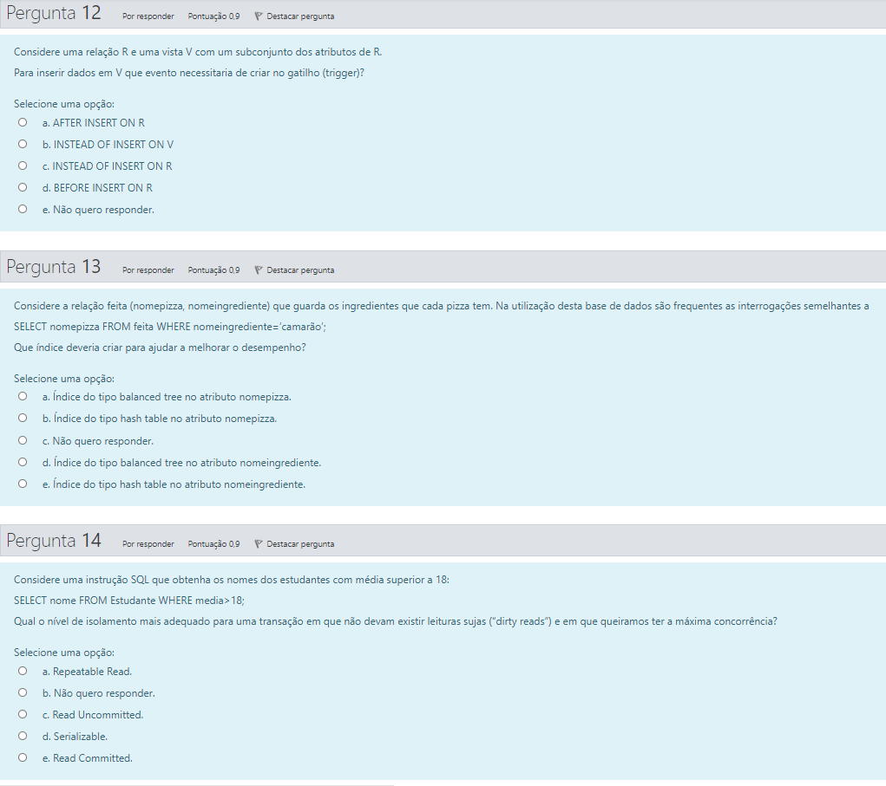

## Pergunta 12

| Item                              | Resposta | Nota |
|-----------------------------------|----------|------|
| **a.** `AFTER INSERT ON R`        | ✖        |      |
| **b.** `INSTEAD OF INSERT ON V`   | ✔        | Resposta correta. |
| **c.** `INSTEAD OF INSERT ON R`   | ✖        |      |
| **d.** `BEFORE INSERT ON R`       | ✖        |      |
| **e.** Não quero responder        | ✖        |      |

## Pergunta 13

```sql
SELECT nomepizza FROM feita WHERE nomeingrediente='camarão';
```

| Item                              | Resposta | Nota |
|-----------------------------------|----------|------|
| **a.**                            | ✖        |      |
| **b.**                            | ✖        |      |
| **c.** Não quero responder        | ✖        |      |
| **d.**                            | ✖        |      |
| **e.**                            | ✔        | Resposta correta. |

## Pergunta 14

| Item                              | Resposta | Nota |
|-----------------------------------|----------|------|
| **a.** Repeatable Read.           | ✖        |      |
| **b.** Não quero responder.       | ✖        |      |
| **c.** Read Uncommited            | ✖        |      |
| **d.** Serializable.              | ✖        |      |
| **e.** Read Commited.             | ✔        | Resposta correta. |


## Pergunta 15

| Item                                                                                           | Resposta | Nota |
|------------------------------------------------------------------------------------------------|----------|------|
| **a.** Sistema que regista e analisa os registos de pesquisa no Google                         | ✖        | DB muito grande. |
| **b.** Banco online                                                                            | ✔        | Consistência é muito importante. |
| **c.** Aplicação web de companhia aérea que permite aos clientes escolherem o seu lugar no voo | ✔        | Consistência é muito importante. |
| **d.** Sistema de Informação Universitário (p.ex.: SIGARRA)                                    | ✔        | Consistência é importante. Base de dados não é assim tão grande. |
| **e.** Sistema que analisa a estrutura de todas as páginas Wikipedia                           | ✖        | DB muito grande. |
| **f.** Loja de comércio eletrónico                                                             | ✔        | Consistência importante (determinar se tem em stock ou não). |
| **g.** Sistema que analisa as relações e dinâmica existente no LinkedIn                        | ✖        | DB muito grande. |

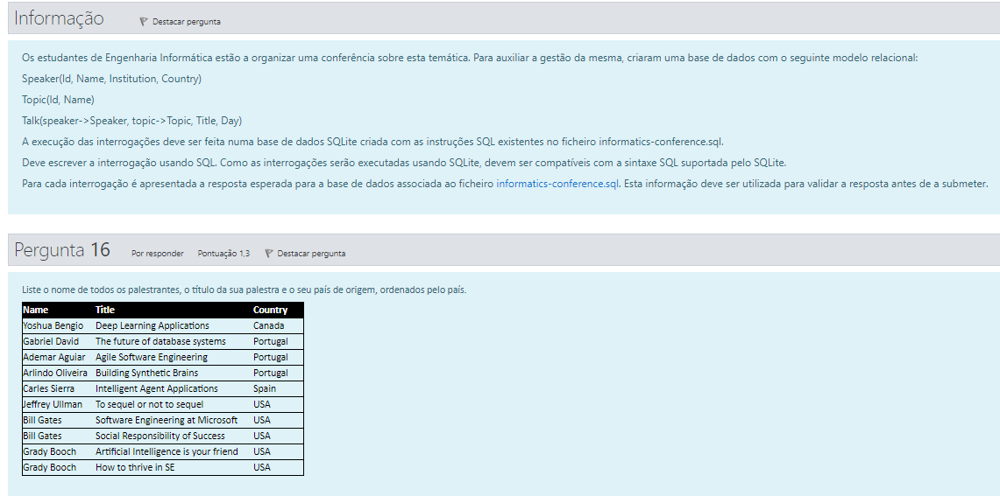

## Pergunta 16

```sql
SELECT Name, Title, Country
FROM Speaker INNER JOIN Talk ON Speaker.Id=Talk.speaker
ORDER BY Country;
```

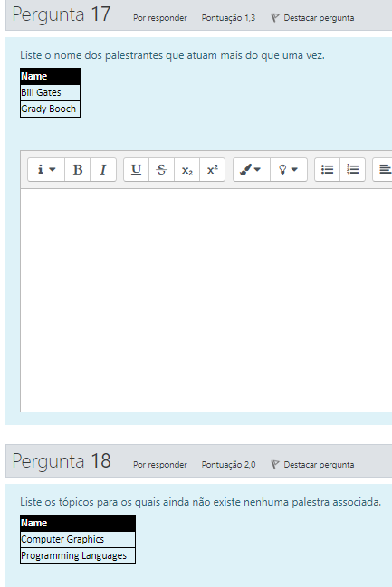

## Pergunta 17

```sql
SELECT Name
FROM Speaker INNER JOIN Talk ON Speaker.Id=Talk.speaker
GROUP BY Id
HAVING COUNT(*) > 1;
```

## Pergunta 18

```sql
SELECT Name
FROM Topic
WHERE Id NOT IN (
    SELECT topic FROM Talk
);
```

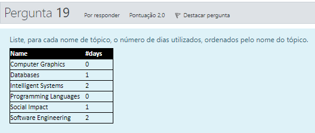

## Pergunta 19

```sql
SELECT Name, COUNT(Day)
FROM (
    SELECT DISTINCT Id, Name, Day
    FROM Topic
    LEFT JOIN Talk ON Topic.Id=Talk.topic
)
GROUP BY Id
ORDER BY Name;
```
